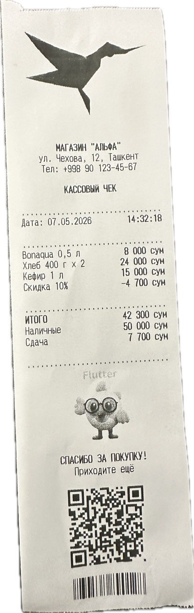

# flutter_xprinter_sdk

Flutter plugin for **XPrinter** thermal receipt printers — connectivity, ESC/POS commands, **first-class Cyrillic support**, **photo dithering**, and **paper-size-aware** layout helpers (58 / 72 / 80 mm).

## Bundled native SDK versions

This release bundles the official XPrinter native SDKs with the plugin, so
you do **not** need to download them separately or run a setup script.

| Platform | Bundled XPrinter SDK |
|---|---|
| **iOS** | XPrinter PrinterSDK **v2.3.0** (`libPrinterSDK.a` + `Headers/`) |
| **Android** | XPrinter `printer-lib-3.2.0.aar` |
| **Windows 10+** | XPrinter ESC/POS Windows SDK **v2.0.4** (`printer.sdk.dll`) |

Tested on XP-58IIT (58 mm BLE) and XP-C260M (80 mm BLE / USB / Ethernet).

## Sample output

Receipt printed by the bundled `example/` app (58 mm thermal):



Cyrillic text, dotted dividers, space-aligned price columns, dithered photo, QR code, and barcode — all from a single demo Dart file (~200 lines). See [`example/lib/main.dart`](example/lib/main.dart).

## Why this plugin

Most ESC/POS Flutter packages target Latin text on a single paper width. This one solves the harder problems that come up in production receipts:

- **Cyrillic that doesn't garble.** The Android Charset API silently returns `?` for CP866 on many devices; this plugin's pure-Dart `encodeToCp866` works on every device.
- **Logos that look crisp instead of stippled.** Built-in Floyd-Steinberg dithering for photos and hard threshold for logos, with content auto-detection.
- **One layout, many paper sizes.** `XprinterLayout.configure(paperSizeMm: 80)` adapts character count, divider width, and image scaling. Same code drives 58 mm and 80 mm prints.
- **Chinese-market printers.** Sends `FS .` to cancel multi-byte mode before applying CP866, so models like the XP-C260M print Cyrillic correctly out of the box.

## Installation

### 1. Add the dependency

```yaml
dependencies:
  flutter_xprinter_sdk: ^0.2.0
```

```bash
flutter pub get
```

### 2. Install platform dependencies

The iOS static library and headers, Android AAR, and Windows DLL are bundled
with the plugin and linked into the host application automatically.

```bash
cd ios && pod install && cd ..
flutter clean && flutter run
```

That's it.

If you install from pub.dev, there is no separate XPrinter download or vendor
setup step.

### 3. Permissions

**Android.** The plugin's `AndroidManifest.xml` already declares the Bluetooth,
USB, and Internet permissions. **However**, on Android 12+ (API 31+) you must
request `BLUETOOTH_SCAN` and `BLUETOOTH_CONNECT` at runtime before calling any
scan/connect method. On Android 11 and older, Bluetooth discovery results also
require runtime location permission. The example app uses
[`permission_handler`](https://pub.dev/packages/permission_handler):

```dart
import 'package:permission_handler/permission_handler.dart';

await [
  Permission.bluetoothScan,
  Permission.bluetoothConnect,
].request();
await Permission.locationWhenInUse.request(); // Android <= 11 discovery
```

**iOS.** Add to your app's `Info.plist`:

```xml
<key>NSBluetoothAlwaysUsageDescription</key>
<string>Used to connect to thermal receipt printers.</string>
<key>NSBluetoothPeripheralUsageDescription</key>
<string>Used to connect to thermal receipt printers.</string>
```

**Windows.** The vendor SDK supports USB, TCP/IP, and serial ports. This
plugin currently exposes USB and TCP through the existing connection API.
Direct Bluetooth discovery and MAC-address connections are not available on
Windows.

## Quick start

```dart
import 'dart:typed_data';
import 'package:flutter_xprinter_sdk/flutter_xprinter_sdk.dart';

Future<void> printSimpleReceipt() async {
  // 1. List paired Bluetooth devices and pick one.  For live advertising
  //    devices use `XprinterBluetooth.startDiscovery(timeout:)` instead.
  final devices = await XprinterBluetooth.getBondedDevices();
  final printer = devices.first;
  await XprinterConnection.connect(
    type: XprinterConnectionType.bluetooth,
    address: printer.address,
  );

  // 2. Initialise.
  await PosPrinter.initialize();
  await PosPrinter.sendRawCommand(Uint8List.fromList(<int>[0x1C, 0x2E])); // FS . (cancel Chinese mode)
  await PosPrinter.selectCodePage(XprinterCodePage.pc866);
  XprinterLayout.configure(paperSizeMm: 58);

  // 3. Print.
  await XprinterLayout.printLine('Спасибо за покупку!', alignment: XprinterAlignment.center);
  await XprinterLayout.printSectionDivider();
  await XprinterLayout.printValueRow('Bonaqua 0,5 л', '8 000 UZS');
  await XprinterLayout.printBoldRow('ИТОГО', '8 000 UZS');

  // 4. Cut & disconnect.
  await PosPrinter.feedLine(3);
  await PosPrinter.cutPaper();
  await XprinterConnection.disconnect();
}
```

See [`example/`](example/) for a full sample app.

## API reference

### Connection — `XprinterConnection` / `XprinterBluetooth`

| Call | Purpose |
|---|---|
| `XprinterBluetooth.getBondedDevices()` | Returns already-paired BT devices (`Future<List<…>>`). |
| `XprinterBluetooth.startDiscovery(timeout:)` | Streams advertising BT devices live (`Stream<…>`). |
| `XprinterConnection.connect(type:, address:)` | Connects via BT / USB / TCP. |
| `XprinterConnection.disconnect()` | Closes the active connection. |
| `XprinterConnection.isConnected()` | Polls connection state. |

### Low-level commands — `PosPrinter`

| Call | Purpose |
|---|---|
| `PosPrinter.initialize()` | ESC `@` reset. |
| `PosPrinter.selectCodePage(page)` | Sets the active code page (CP437, CP866, etc.). |
| `PosPrinter.printText(...)` / `printColumnsText(...)` | Plain text / multi-column text. |
| `PosPrinter.printBitmap(bytes, alignment, widthDots)` | Raster image. |
| `PosPrinter.printQRCode(content, moduleSize, level, alignment)` | QR code. |
| `PosPrinter.printBarCode(...)` | Code128 / EAN13 / UPC-A barcodes. |
| `PosPrinter.printHorizontalLine(widthDots, heightRows, alignment)` | Solid black bar. |
| `PosPrinter.feedLine(n)` / `cutPaper(half:)` | Paper feed and cut. |
| `PosPrinter.sendRawCommand(bytes)` | Escape hatch for arbitrary ESC/POS bytes. |

### Layout helpers — `XprinterLayout`

Paper-size-aware text composition. Call `XprinterLayout.configure(paperSizeMm:)` once per print job before any other helper.

| Helper | Layout |
|---|---|
| `printLine(text, alignment:, bold:)` | One line of text, CP866-encoded. |
| `printInfoRow(label, value)` | `Label: value` with bold label, regular value. |
| `printValueRow(label, value)` | `label .... value` with regular label and bold value. |
| `printPlainRow(label, value)` | `label .... value`, both regular weight. |
| `printBoldRow(label, value)` | Fully bold (ИТОГО / section headers). |
| `printDiscountRow(label, value)` | Alias for `printValueRow`. |
| `printSectionDivider()` | Solid horizontal line, paper-width. |
| `printAssetIcon(assetPath, heightDots:, alignment:)` | Cached PNG asset, sized to dots. |
| `printIconTextRow(entries)` | `(icon + text)` pairs side-by-side, wrap to fit. |

### Cyrillic — `encodeToCp866`

```dart
final bytes = encodeToCp866('Спасибо');  // → CP866 bytes
```

Pure-Dart lookup, no platform dependency. Use it directly when you need to bypass `XprinterLayout` for custom rows.

### Image preparation — `XprinterImageLoader`

```dart
// From a remote URL (e.g. merchant logo on a CDN).
final bytes = await XprinterImageLoader.fromUrl(
  url: 'https://example.com/logo.png',
  targetWidthDots: 384,
  mode: XprinterImageMode.auto,  // or .threshold for logos, .dither for photos
);
if (bytes != null) {
  await PosPrinter.printBitmap(bytes, widthDots: 384);
}

// From a Flutter asset.
final iconBytes = await XprinterImageLoader.fromAsset(
  assetPath: 'assets/printer/store_logo.png',
  targetWidthDots: 384,
);

// From already-loaded bytes.
final binarised = XprinterImageLoader.fromBytes(
  bytes: rawPngBytes,
  targetWidthDots: 384,
);
```

All three return PNG bytes ready for `PosPrinter.printBitmap`. The image is downloaded / decoded → resized to `targetWidthDots` preserving aspect → flattened over white → binarised.

### Dithering — `XprinterImageDither`

Lower-level access to the binarisation pipeline if you want to compose images yourself before binarising:

```dart
final composed = img.Image(width: 384, height: 200);
// ... draw into [composed] ...
final pngBytes = XprinterImageDither.binarise(composed, mode: XprinterImageMode.threshold);
```

`XprinterImageMode`:
- `.auto` — counts mid-tone pixels, picks threshold for logos / dither for photos.
- `.threshold` — hard cutoff, sharp edges. Best for logos.
- `.dither` — Floyd-Steinberg, smooth tone reproduction. Best for photos.

## Paper size

| `paperSizeMm` | Chars/line (Font A) | Print head dots |
|---|---|---|
| 58 | 32 | 384 |
| 72 | 42 | 512 |
| 80 | 48 | 576 |

## Troubleshooting

**The receipt prints Chinese characters where Cyrillic should be.**
Some 80 mm models (XP-C260M, etc.) start in multi-byte Chinese mode. Send `FS .` (`0x1C 0x2E`) before `selectCodePage`:

```dart
await PosPrinter.initialize();
await PosPrinter.sendRawCommand(Uint8List.fromList(<int>[0x1C, 0x2E]));
await PosPrinter.selectCodePage(XprinterCodePage.pc866);
```

**Image prints as a solid black square.**
The image had transparent pixels and the SDK rendered them as black. `XprinterImageLoader` handles this for you (flattens over white). If you're calling `PosPrinter.printBitmap` directly with a PNG that has alpha, flatten it first.

**Logo prints stippled instead of solid black.**
Pass `mode: XprinterImageMode.threshold` to force the hard-threshold path. Auto-detection can misclassify small upscaled icons as photo-like.

**`net.posprinter.*` not found at link time on Android.**
Make sure the plugin package contains
`android/libs/printer-lib-3.2.0.aar`, then run `flutter clean` and rebuild.

**Windows build says `printer.sdk.dll` was not found.**
Make sure the plugin package contains
`windows/xprinter_sdk/x64/printer.sdk.dll`, then run `flutter clean` and
rebuild the application.

## Licence

This wrapper is MIT-licensed (see [LICENSE](LICENSE)).

The iOS, Android, and Windows SDK binaries are included in this distribution.
Review XPrinter Co., Ltd.'s licence terms before shipping the vendor binaries
in your app.

## Contributing

Issues and pull requests welcome at <https://github.com/Lazizbek97/flutter_xprinter_sdk>.
